# Resumo

## Sumário
- [Desafio](#desafio)
- [Cursos](#cursos)
    - [Fundamentals of Analytics on AWS - Part 2](#analytics-part2)
    - [AWS Glue Getting Started](#glue-getting-started)
- [Exercícios](#exercicios)
    - [Parte 1 - Geração e Massa de Dados](#ex1)
        - [Etapa 1](#ex1-et1)
        - [Etapa 2](#ex1-et2)
        - [Etapa 3](#ex1-et3)
    - [Parte 2 - Apache Spark](#ex2)
- [Laboratório - AWS Glue](#lab)

## <a name="desafio">Desafio</a>
Pasta contendo arquivos e README.md referente ao desafio proposto:
- [Pasta do desafio](/Sprint8/Desafio/)
- [README.md do desafio](/Sprint8/Desafio/README.md)

## <a name="cursos">Cursos</a>
### <a name="analytics-part2">Fundamentals of Analytics on AWS - Part 2</a>
- Benefício dos Data Lakes
    - Escalabilidade:
        - Armazenar grandes quantidades de dados;
        - Aumentar ou reduzir verticamente a escala do armazenamento conforme necessário;
        - Armazenar vários tipos de dados.
    - Eficiência de custos:
        - Reduzir os custos com armazenamento de baixo custo, como o Amazon S3 ou o EMRFS;
        - Desenvolver esquemas ao longo do tempo, o que reduz os custos de modelagem;
        - Pagar somente pelo armazenamento usado em comparação com a capacidade alocada.
    - Flexibilidade:
        - Armazenar dados estruturados, não estruturados e semiestruturados;
        - Aplicar esquemas posteriormente, conforme necessário, para análise;
        - Carregar facilmente novas fontes e tipos de dados.
    - Análise mais rápida:
        - Evitar os processos de ETL, executar e fazer consultas no local para uma análise improvisada;
        - Processar dados em tempo real e em lote.
    - Visualização centralizada:
        - Visualizar o seu repositório de dados em uma única exibição;
        - Consultar uma única fonte confiável em vez de sistemas diferentes;
        - Aplicar políticas comuns de governança e segurança.
- Vantagens do Amazon Redshift:
    - Escalabilidade;
    - Agilidade;
    - Eficiência de custos;
    - Desempenho;
    - Durabilidade;
    - Segurança;
    - Tecnologia serverless;
    - Machine Learning;
    - Automação;
    - Compartilhamento de dados.
- Pilares de uma arquitetura de dados moderna:
    - Data Lakes escaláveis;
    - Serviço de analytics com propósito específico;
    - Acesso unificado a dados;
    - Governança unificada;
    - Desempenho e relação custo-benefício.
### <a name="glue-getting-started">AWS Glue Getting Started</a>
- Quais problemas o AWS Glue resolve:
    - Provisiona e gerencia o ciclo de vida dos recursos;
    - Fornece ferramentas interativas;
    - Gera código automáticamente;
    - Conecta-se a centenas de armazenamentos de dados;
    - Cria um catálogo de dados para várias fontes de dados;
    - Identifica dados sigilosos usando padrões de reconhecimento de ML para PII;
    - Gerencie e aplique esquemas em aplicações de streaming de dados;
    - Oferece qualidade de dados e auto scaling de dados.
- Benefícios do AWS Glue:
    - Integração de dados mais rápida;
    - Automatizar a integração de dados em grande escala;
    - Nenhuma infraestrutura para gerenciar;
    - Criar, executar e monitorar tarefas de ETL sem codificação;
    - Pagar somente pelo que usar.

## <a name="exercicios">Exercícios</a>
### <a name="ex1">Parte 1 - Geração e Massa de Dados</a>
#### <a name="ex1-et1">Etapa 1</a>
- Com uma lista contendo 250 números aleatórios, aplique o método reverse e imprima o resultado:

    - [script (py)](/Sprint8/Exercicios/ex1/etapa-1/main.py)

    ```python
    # realizando import da lib utilizada
    from random import randint as ri

    # gerando 250 números aleatórios a partir de uma list-comprehension
    lista_num = [ri(1, 1000) for num in range(250)]

    # utilizando método solicitado para reverter ordem da lista
    lista_num.reverse()

    # printando resultado
    print(lista_num)
    ```
#### <a name="ex1-et2">Etapa 2</a>
- Declarar uma lista com 20 nomes de animais, ordenar em ordem crescente e iterar sobre os itens, imprimindo um a um. Armazenar conteúdo da lista em um arquivo de texto, um item em cada linha.

    - [script (py)](/Sprint8/Exercicios/ex1/etapa-2/main.py)
    - [arquivo gerado (txt)](/Sprint8/Exercicios/ex1/etapa-2/animais.txt)

    ```python
    import os

    # caminho onde o arquivo txt será salvo
    caminho = "/home/varani/repos/compass_matheus_varani/Sprint8/Exercicios/ex1/etapa-2/animais.txt"

    # criando lista contendo nomes dos animais
    animais = ["macaco", "abelha", "zebra", "cachorro", "gato", 
            "libélula", "elefante", "girafa", "panda", "coala",
            "canguru", "golfinho", "leopardo", "leão", "hiena",
            "mosquito", "lêmure", "furão", "morcego", "rato"]

    # ordenando lista
    animais.sort()

    # printando todos os itens da lista
    [print(animal) for animal in animais]

    # verificando se arquivo existe, se não existir ele é gerado
    os.system(f'[ -f {caminho} ] || touch {caminho}')

    # iterando pela lista e adicionando os itens ao arquivo
    [os.system(f"echo {animal} >> {caminho}") for animal in animais]
    ```
#### <a name="ex1-et3">Etapa 3</a>
- Gerar um arquivo com nomes aleatórios.

    - [script (py)](/Sprint8/Exercicios/ex1/etapa-3/main.py)
    - [arquivo gerado (txt)](/Sprint8/Exercicios/ex1/etapa-3/nomes_aleatorios.txt)

    ```python
    import random, os, names

    # definindo semente de aleatoriedade
    random.seed(40)

    # quantidade de nomes aleatórios
    qtd_nomes_unicos = 5000

    # quantia total de nomes
    qtd_nomes_aleatorios = 12000

    # adicionando nomes que serão utilizados na lista auxiliar
    aux = []
    for i in range(0, qtd_nomes_unicos):
        aux.append(names.get_full_name())

    # usando `random.choice` para pegar um valor aleatório da lista aux e depois
    # adicionando o nome a lista `dados`
    print(f"Gerando {qtd_nomes_aleatorios} nomes aleatórios...")
    dados = []
    for i in range(0, qtd_nomes_aleatorios):
        dados.append(random.choice(aux))

    # caminho onde arquivo será gravado
    path = "/home/varani/repos/compass_matheus_varani/Sprint8/Exercicios/ex1/etapa-3/nomes_aleatorios.txt"

    # verificando se arquivo existe, se não ele é gerado
    os.system(f"[ -f {path} ] || touch {path}")

    # adicionando nomes ao arquivo
    with open(path, "a") as file:
        [print(nome, file=file) for nome in dados]
    ```
### <a name="ex2">Parte 2 - Apache Spark</a>
- Utilize o arquivo contendo os nomes aleatórios para criar um DataFrame e testar uma série de comandos.

    - [arquivo com nomes aleatórios (txt)](/Sprint8/Exercicios/ex2/nomes_aleatorios.txt)
    
    - [Dockerfile](/Sprint8/Exercicios/ex2/Dockerfile)
        
        ```Dockerfile
        # imagem utilizada
        FROM jupyter/all-spark-notebook

        # diretório para onde serão copiados os arquivos
        WORKDIR /work

        # copiando todos os arquivos para o WORKDIR
        COPY . .

        # expondo a porta 8888 para acessar o Jupyter (não utilizei, mas é uma possibilidade a mais)
        EXPOSE 8888
        ```
        - Utilizado para montar um ambiente com Spark.
    
    - [lista de comandos (txt)](/Sprint8/Exercicios/ex2/comandos.txt)

        ```bash
        # montando imagem a partir do Dockerfile
        docker build -t s8-ex2-et1 .

        # subindo container a partir da imagem
        docker run -p 8888:8888 -it --name s8-ex2-et1 --rm s8-ex2-et1

        # conectando a sessão atual ao container
        docker exec -it s8-ex2-et1 bash

        # executando arquivo
        spark-submit main.py
        ```

    - [script (py)](/Sprint8/Exercicios/ex2/main.py)

        ```python
        from pyspark.sql import SparkSession
        from pyspark import SparkContext
        from random import choice
        from pyspark.sql.functions import when, rand, expr, col

        # gerando sessão
        spark = SparkSession.builder.master("local[*]").appName("Exercicio Intro").getOrCreate()
        # criando DataFrame a partir do arquivo txt
        df_nomes = spark.read.csv("nomes_aleatorios.txt")
        # mostrando 5 linhas do DataFrame
        df_nomes.show(5)

        # printando Schema
        df_nomes.printSchema()
        # renomeando coluna
        df_nomes = df_nomes.withColumnRenamed("_c0", "Nomes")
        df_nomes.show(10)

        # criando coluna `Escolaridade`
        # rand() gera um valor de 0.0 a 1.0
        df_nomes = df_nomes.withColumn(
            "Escolaridade",
            when(rand() < 0.33, "Fundamental")
            .when(rand() < 0.66, "Medio")
            .otherwise("Superior")
            )

        paises = ["Argentina", "Bolivia", "Brasil", "Chile", "Colombia", "Equador", "Guiana", "Paraguai", "Peru", "Suriname", "Uruguai", "Venezuela", "Guiana Francesa"]
        # juntando itens da lista, item necessita estar entre aspas 
        # para query funcionar
        paises_sql = ",".join(f"'{item}'" for item in paises)
        # criando coluna `Pais`
        # usando expr() em conjunto com element_at()
        # para selecionar de forma randomica um item presente na lista
        df_nomes = df_nomes.withColumn(
            "Pais",
            expr(f"element_at(array({paises_sql}), int(rand()*{len(paises)})+1)")
        )

        # mesmo processo realizado acima, porém como se trata de números
        # não é necessário o uso de aspas, apenas a conversão para str
        anos = [ano for ano in range(1945, 2011)]
        anos_sql = ",".join(str(ano) for ano in anos)
        df_nomes = df_nomes.withColumn(
            "AnoNascimento",
            expr(f"element_at(array({anos_sql}), int(rand()*{len(anos)})+1)")
        )

        # selecionando todas as colunas onde o AnoNascimento for 
        # igual ou maior a 200
        df_select = df_nomes.select("*").where(col("AnoNascimento") >= 2000)
        df_select.show(10)

        # gerando tabela a partir do DataFrame
        df_nomes.createOrReplaceTempView("pessoas")

        # fazendo a mesma pesquisa porém diretamente da tabela
        spark.sql("SELECT * FROM pessoas WHERE AnoNascimento >= 2000").show()

        # filtrando todas linhas em que o AnoNascimento estiver entre 1980 e 1994
        # e mostrando a quantia resultante
        print(
            df_nomes.filter(
                (col("AnoNascimento") >= 1980)
                & (col("AnoNascimento") <= 1994)
            ).count()
        )

        # fazendo o mesmo, porém com uma query
        spark.sql("SELECT COUNT(*) FROM pessoas WHERE AnoNascimento >= 1980 AND AnoNascimento <= 1994").show()

        # verificando a quantia de pessoas em cada país que se enquadram
        # nas categorias indicadas
        df_resultados = spark.sql("""
        SELECT 
            Pais,
            CASE
                WHEN AnoNascimento BETWEEN 1944 AND 1964 THEN 'Baby Boomers'
                WHEN AnoNascimento BETWEEN 1965 AND 1979 THEN 'Geracao X'
                WHEN AnoNascimento BETWEEN 1980 AND 1994 THEN 'Millennials'
                WHEN AnoNascimento BETWEEN 1995 AND 2015 THEN 'Geracao Z'
            END AS Geracao,
            COUNT(*) AS Quantidade
        FROM
            pessoas
        GROUP BY
            Pais,
            Geracao
        ORDER BY
            Pais,
            Geracao,
            Quantidade
        """)

        # mostrando todo o conteúdo do DataFrame
        df_resultados.show(df_resultados.count())
        ```
## <a name="lab">Laboratório - AWS Glue</a>
- Criando bucket

    
- Adicionando CSV file no bucket

    
- Criando job no Glue

    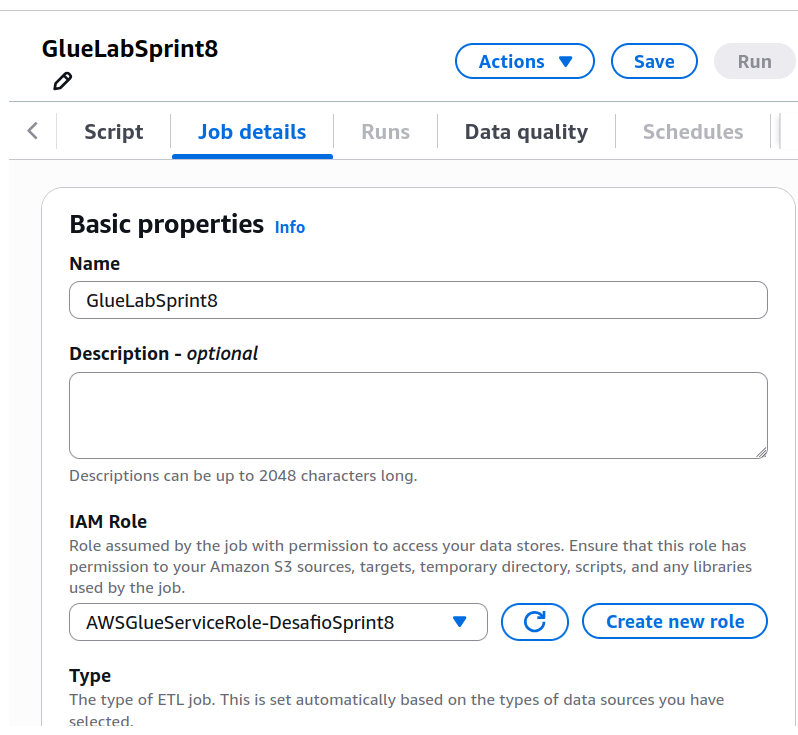
- Setando parametros

    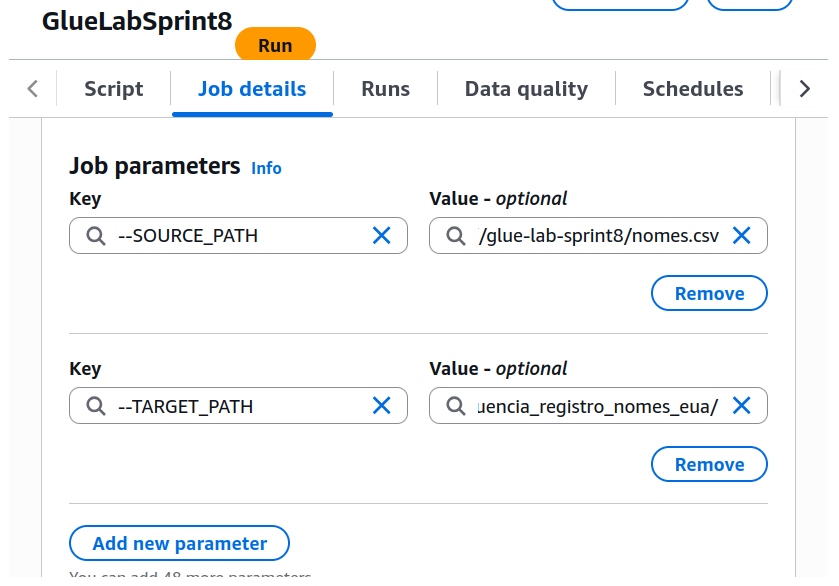
- Adicionando codigo testado localmente

    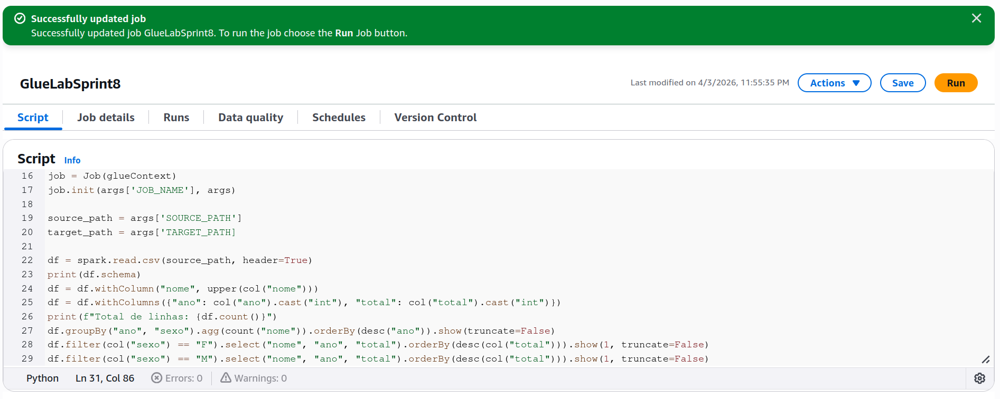
    - Lendo o arquivo csv

        ```python
        df = spark.read.csv(source_path, header=True)
        ```
    - Imprimindo Schema

        ```python
        print(df.schema)
        ```
        
    - Alterando valores da coluna `nome` para maiusculo

        ```python
        df = df.withColumn("nome", upper(col("nome")))
        ```
        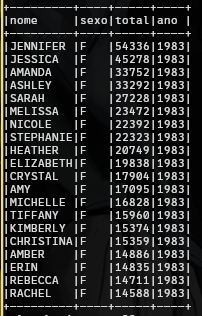
    - Alterando tipo das colunas para conseguir ordenar

        ```python
        df = df.withColumns({"ano": col("ano").cast("int"), "total": col("total").cast("int")})
        ```
    - Total de linhas do DataFrame

        ```python
        print(f"Total de linhas: {df.count()}")
        ```
        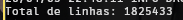
    - Printar
        - Contagem de nomes;
        - Agrupar por ano e sexo;
        - Ordem decrescente por ano.

        ```python
        df.groupBy("ano", "sexo").agg(count("nome")).orderBy(desc("ano")).show(truncate=False)
        ```
        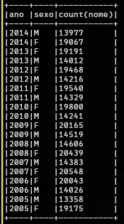
    - Nome feminino com mais registros e em que ano ocorreu

        ```python
        df.filter(col("sexo") == "F").select("nome", "ano", "total").orderBy(desc(col("total"))).show(1, truncate=False)
        ```
        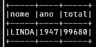
    - Nome masculino com mais registros e em que ano ocorreu

        ```python
        df.filter(col("sexo") == "F").select("nome", "ano", "total").orderBy(desc(col("total"))).show(1, truncate=False)
        ```
        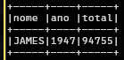
    - Total de registros masculinos e femininos para cada ano
        - 10 primeiras linhas;
        - Ordem crescente por ano.

        ```python
        df.groupBy("ano").agg(sum("total")).orderBy("ano").show(10, truncate=False)
        ```
        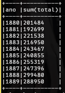
    - Escrever DataFrame no S3
        - subdiretorio: frequencia_registro_nomes_eua
        - formato: JSON
        - particionamento: sexo, ano

        ```python
        df.write.mode("overwrite").partitionBy("sexo", "ano").format("json").save(target_path)
        ```
- Rodando Job

    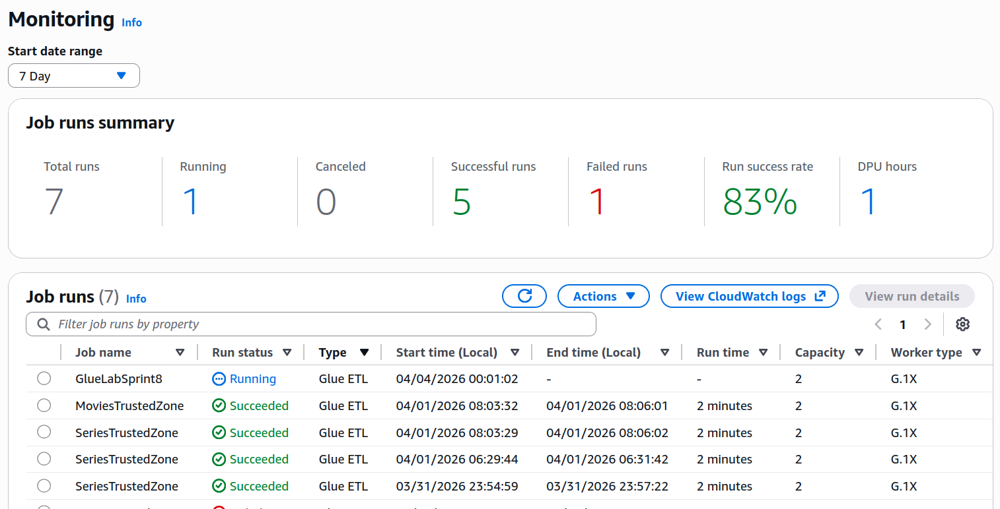
    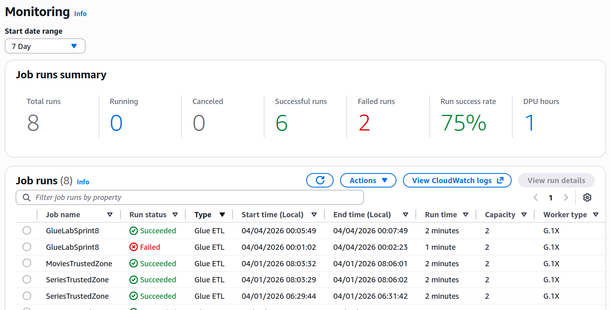
- Arquivo gerado no S3
    
    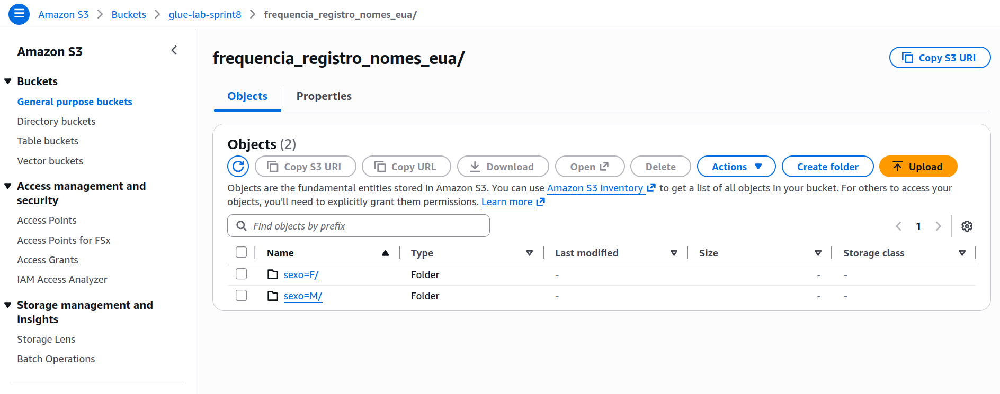
    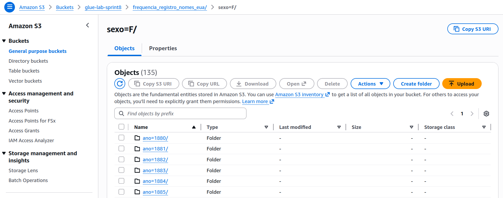
    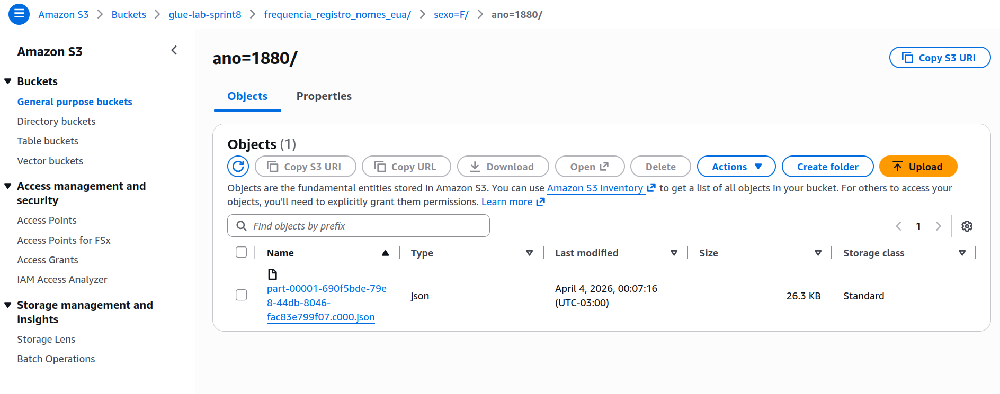
- Nomeando Crawler

    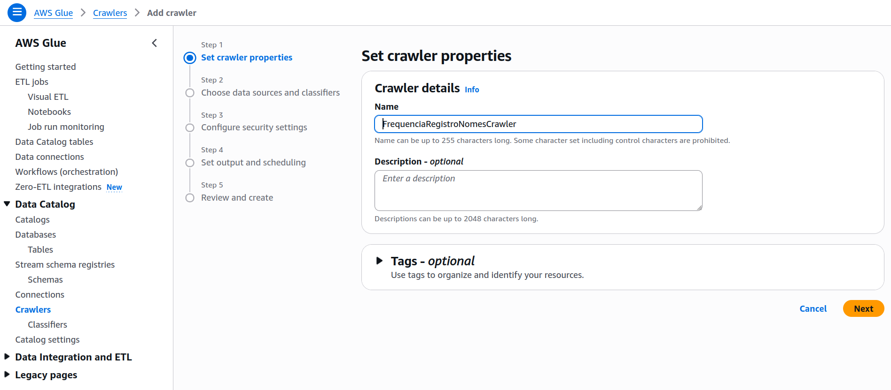
- Escolhendo Data Source do Crawler

    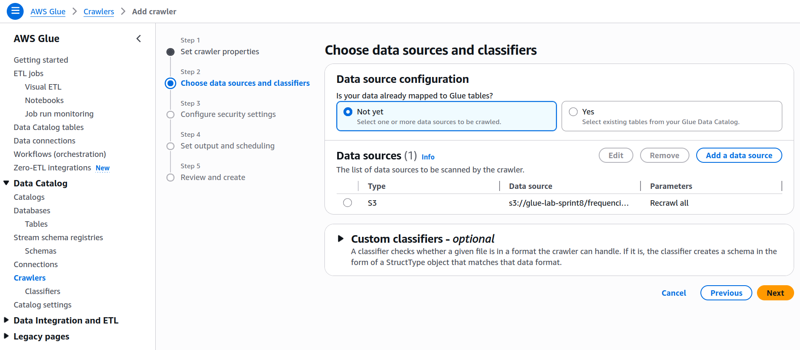
- Setando IAM Role

    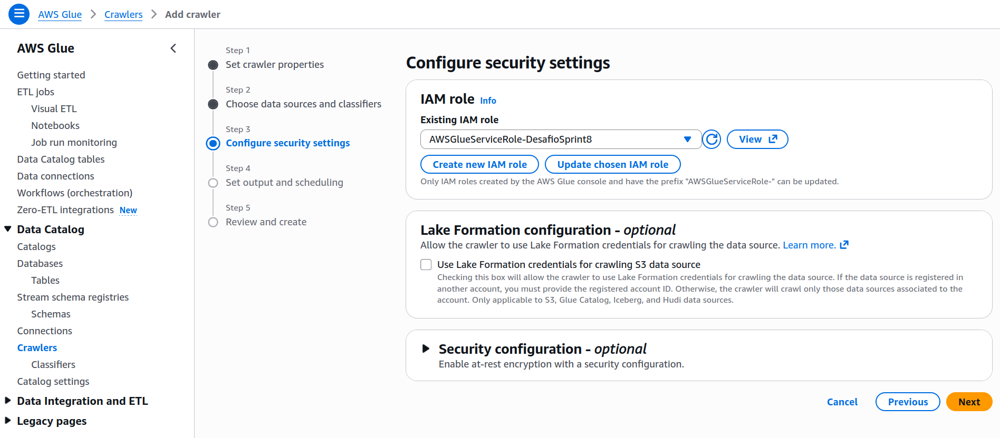
- Criando Database

    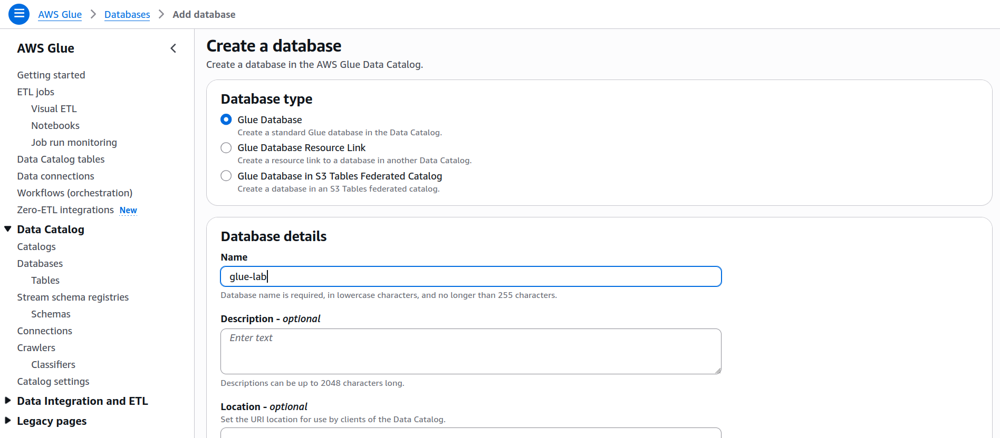
- Setando Database

    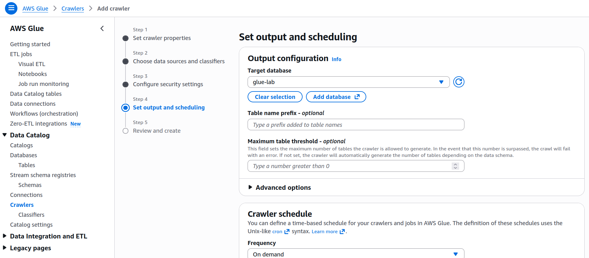
- Criando Crawler

    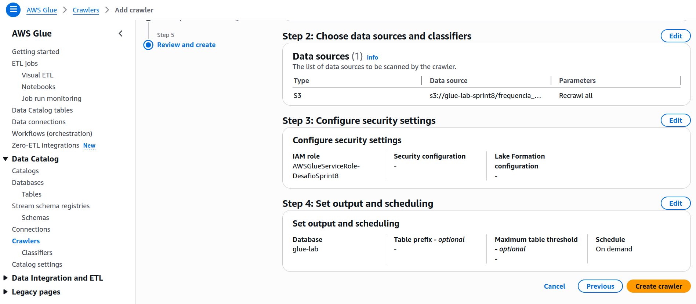
- Rodando Crawler

    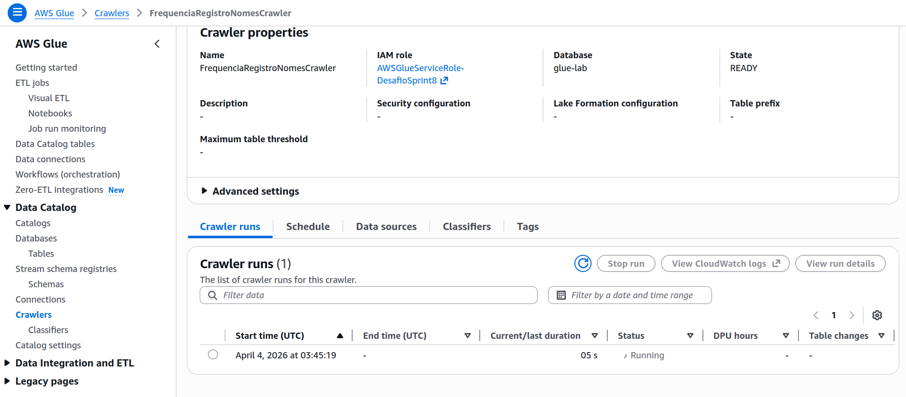
    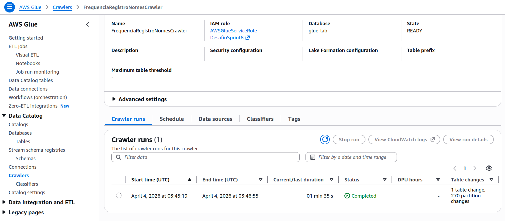
- Tabela gerada

    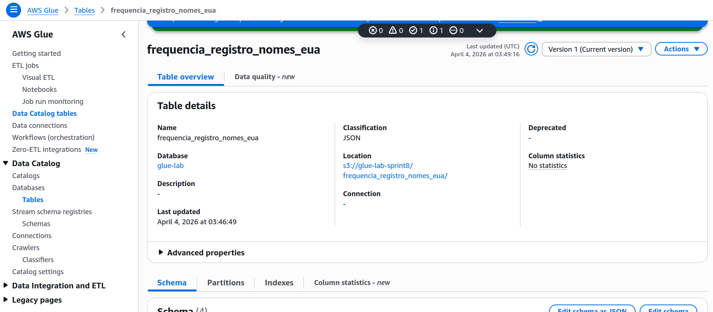
    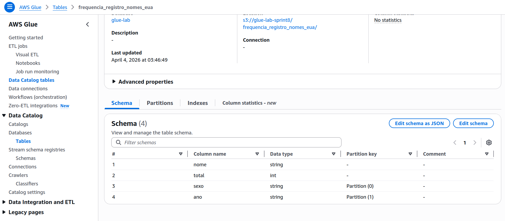
- Configurando Athena

    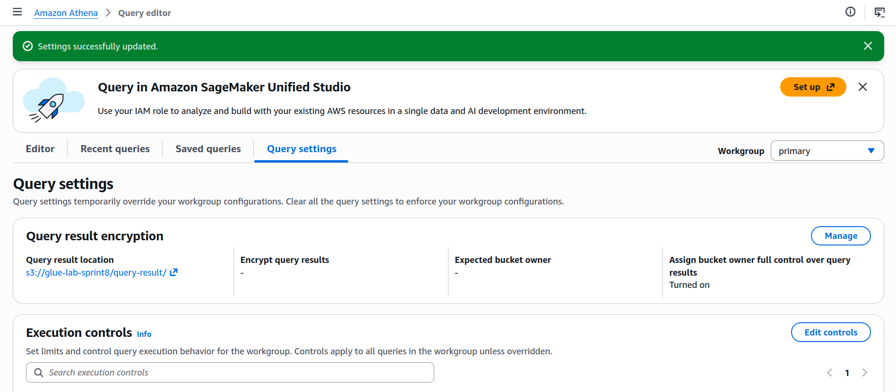
- Testando query

    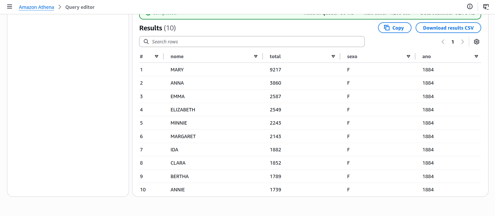