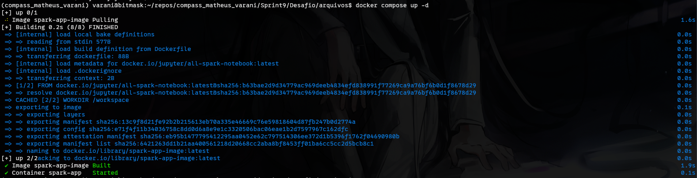
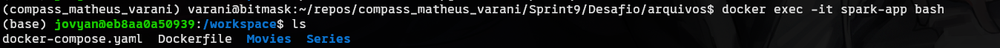

# Desafio

## Sumário
- [Montando ambiente para desenvolvimento local](#et1)
- [Desenvolvimento - Manipulação de dados com Spark](#et2)
- [Glue](#et3)
- [Crawler](#et4)
- [Athena](#et5)

## <a name="et1">Montando ambiente para desenvolvimento local</a>
- [Dockerfile](/Sprint8/Desafio/arquivos/Dockerfile)
    
    ```Dockerfile
    # imagem que contém o ambiente com Spark
    FROM jupyter/all-spark-notebook

    # diretório para onde os arquivos serão persistidos
    # e onde iremos rodar o script
    WORKDIR /workspace
    ```
- [docker-compose.yaml](/Sprint8/Desafio/arquivos/docker-compose.yaml)
    
    ```yaml
    services:
        app:
            build:
                # local onde o Dockerfile se encontra
                context: .
                # nome do arquivo
                dockerfile: Dockerfile
            # nome do container
            container_name: spark-app
            # nome da imagem que o container irá rodar
            image: spark-app-image
            # diretório que será persistido para o WORKDIR
            volumes:
                - ./:/workspace:cached
            # evita que o container encerre sua execução
            command: sleep infinity
    ```
- Comandos:

    ```bash
    # adicionei os arquivos PARQUET a pasta que contém o Dockerfile e docker-compose.yaml
    # fui até o diretório e executei:
    docker compose up -d
    # -d roda o container em background
    ```
    
    ```bash
    # abri uma nova sessão no terminal e acessei o container com:
    docker exec -it spark-app bash
    ```
    
    ```bash
    # criei um arquivo python para a modelagem e a cada alteração, testei o códico com:
    spark-submit *.py
    ```
## <a name="et2">Desenvolvimento - Manipulação de dados com Spark</a>